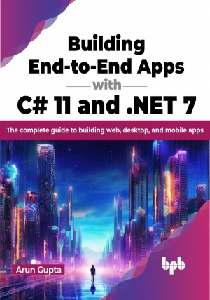

# Building End-to-End Apps with C# 11 and .NET 7

Learn how to use C# 11 to build apps for any platform, from the ground up

This is the repository for [Building End-to-End Apps with C# 11 and .NET 7
](https://bpbonline.com/products/building-end-to-end-apps-with-c-11-and-net-8?variant=43034073170120),published by BPB Publications.

## About the Book
C# 11 is the latest version of C#, a popular programming language for building cloud, web, and desktop applications. It is a powerful and versatile language that can create a wide range of applications, from simple command-line tools to complex enterprise systems.

This book teaches you how to use C# 11, the latest version of C#, to build real-world applications. It introduces the new language features in C# 11, such as global using directives, file-scoped namespaces, and top-level statements. Then, it shows you how to use these features to write code that is more concise and expressive. Next, the book teaches you how to build various applications using C# 11, including web apps, mobile apps, desktop apps, and machine learning models. You'll learn to use ASP.NET Core, gRPC, Blazor, Angular, WPF, WinUI 3, .NET MAUI, and ML.NET. Throughout the book, you'll also learn the best practices for writing clean, efficient, and maintainable codes.

By the end of the book, you will have a deep understanding of C# 11 and how to use it to build a wide range of cloud, web, and desktop applications.

## What You Will Learn
• Get an overview of the new language enhancements in C# 11.

•  Create simple applications from start to finish using a built-in project template step-by-step.

•  Learn related concepts, and be aware of the nuances, pitfalls, and workarounds while creating each application.

•  Reflect on the testing and deployment strategies for each application type.

•  Challenge yourself to think deeper and learn more with end-of-chapter exercises.
